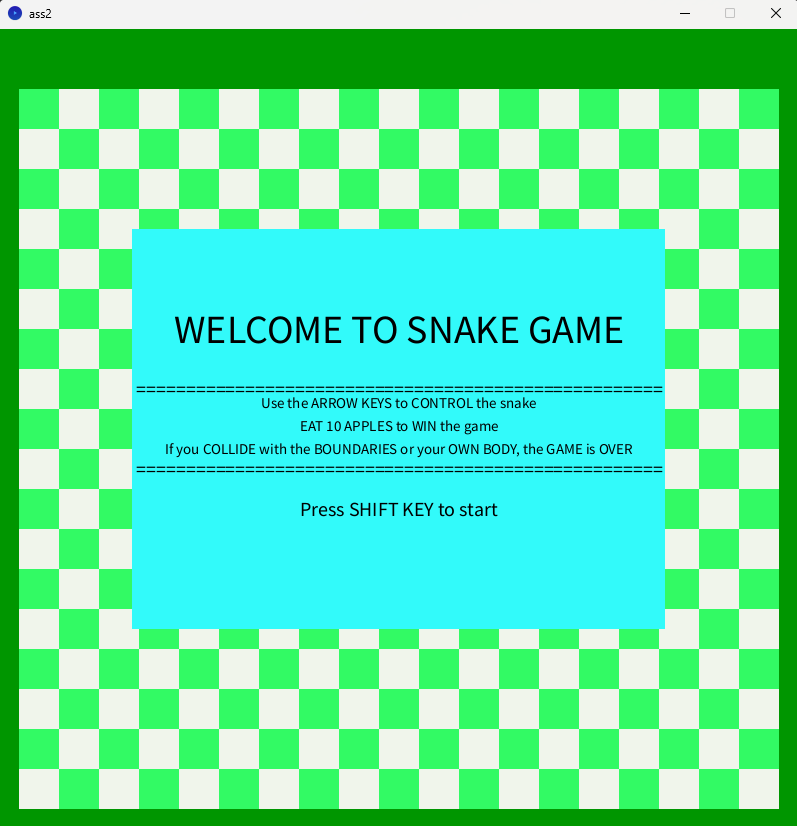
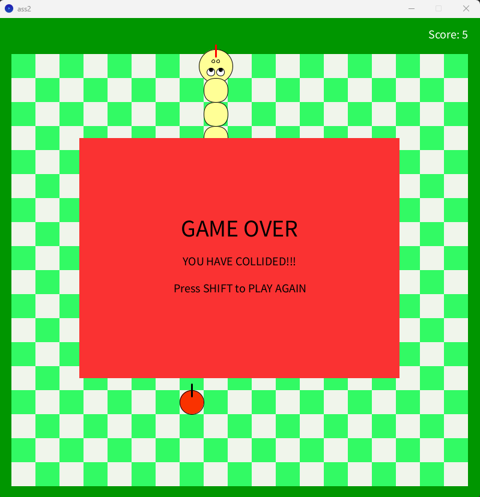
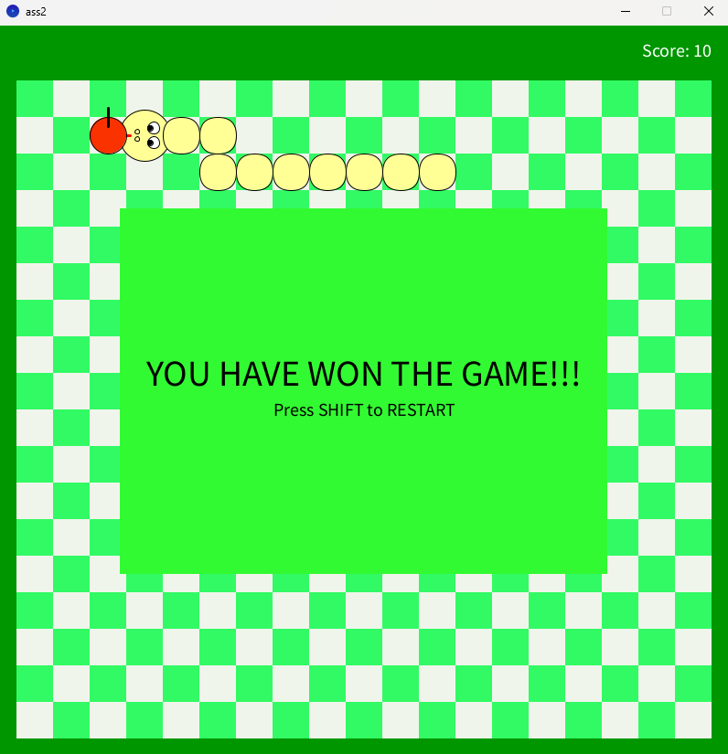

# 🐍 Snake Game – Processing Project

A modern, animated recreation of the classic **Snake Game** built using Java in the **Processing IDE**.  
This project was developed as part of a core programming unit at Macquarie University to demonstrate problem-solving, interactive design, and clean modular code structure.

---

## 📌 Project Overview

This is a fully functional game with user-friendly controls, a visually engaging grid, and interactive states. The game demonstrates:

- ✔️ 2D grid layout and real-time rendering  
- ✔️ Real-time snake movement and keyboard-based controls
- ✔️ Game states: Welcome, Game Running, Win, and Game Over  
- ✔️ Apple generation and scoring logic  
- ✔️ Modular functions and clean game logic  
- ✔️ Collision detection (walls and self)  
- ✔️ Custom snake visuals with direction-aware animation  

---

## 🧠 Skills Demonstrated

- Structured problem-solving and modular thinking  
- Java programming fundamentals and logic building
- Real-time interaction using event handling
- 2D graphics with condition-based rendering
- Game state and transition management
- Modular code structure for readability and scalability

---

## 📁 How to Run

1. Download and install the [Processing IDE](https://processing.org/download/)
2. Open the `.pde` file from this repository
3. Click **Run** (▶️)
4. Press `SHIFT` to start the game

---

## 🎮 Controls

| Key        | Action                        |
|------------|-------------------------------|
| `SHIFT`    | Start or Restart the game     |
| `← ↑ → ↓` | Control snake direction        |

---

## 🎯 Win & Lose Conditions

- Win: Eat 10 apples  
- Lose: Collide with the wall or your own body

---

## Screenshots

---

## 🛠 Technologies Used

- **Language**: Java  
- **Environment**: [Processing IDE](https://processing.org/download/)  
- **Version**: Tested on Processing 4.0+

---

## 🏫 University Project

- **Macquarie University**  
- **Course**: COMP1000 – Introduction to Programming  
- **Student ID**: 47694653  
- **Year**: 2023  
- **Author**: Kreijesh Kumar (Giri) Sundaramoorthy

---

## 🧾 License

This project is shared for educational and portfolio purposes.  
Feel free to adapt, extend, or showcase it in your learning journey.

---

## 🙋‍♂️ Author

**Giri**  
Final Year IT Student | Macquarie University  
Aspiring Software Developer & Creative Technologist

---
